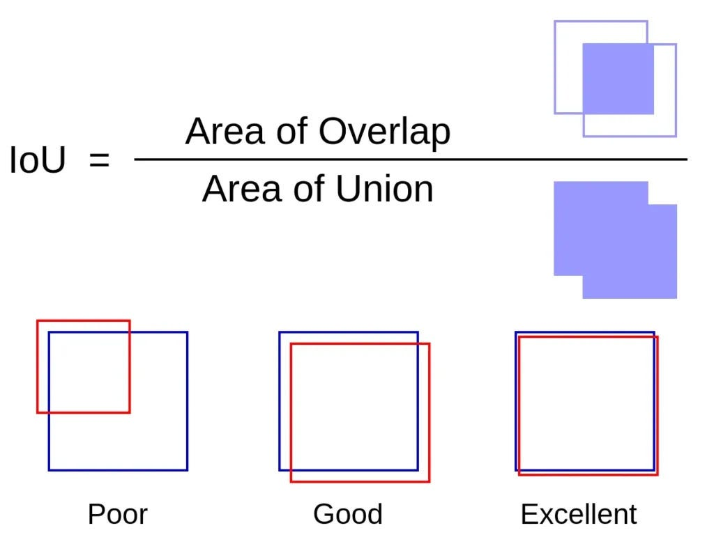
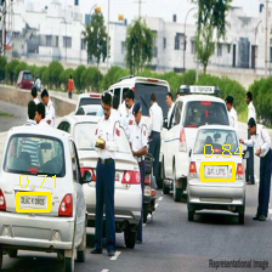

# **VEHICLE LICENSE PLATE RECOGNITION**

--------------------

## **0. Introduction**

In recent years, the development of science and technology has had many outstanding achievements in general and in the field of Artificial Intelligence (AI) in particular. In the field of imaging, people have been able to take advantage of collecting images from digital electronic devices such as cameras, camcorders, etc. and use them as input for AI models and take advantage of the computing and learning capabilities of AI models to create predictive models serving humans such as traffic control, behavior and emotion recognition, etc. In particular, in the field of transportation, AI has many practical applications serving human interests such as predicting traffic jams, identifying vehicles participating in traffic, recognizing license plates, etc.

<div align="center">
    
</div>

In this project, we will research and build a small application on license plate recognition based on the **License Plate** dataset from the **Roboflow**[^1] source and perform the **Fine Tuning** technique and use a pre-trained model such as **Resnet**, **MobileNet**,... to make the backbone for the **Faster RCNN**[^2] model.

<div align="center">
    
</div>

--------------------

## **1. Library**

In this project, we need some external libraries such as OpenCV, Pytorch,... (version details in the [requirements](./requirements.txt) file). Because this project needs to process image features, the OpenCV library is a specialized tool for image problems such as loading images, resizing,... The **Pytorch**[^3] library is a popular tool specializing in building deep learning models, the library provides us with classes, metrics, optimizers,... to help us build the desired models, more specifically, this library provides us with classes such as **Dataset**, **DataLoader** to help build dataset models to avoid memory overflow problems when saving all images in an array. In addition, supporting libraries such as **Numpy**, **Matplotlib**,...

--------------------

## **2. The project structure**

```bash
├── app
│   ├── inputs
│   │   ├── images
│   │   │   ├── sample_image_0.jpg
│   │   │   ├── sample_image_1.jpg
│   │   │   └── sample_image_2.jpg
│   │   └── videos
│   │       ├── sample_video_0.mp4
│   │       ├── sample_video_1.mp4
│   │       └── sample_video_2.mp4
│   ├── image_demo.py
│   └── video_demo.py
├── assets
│   ├── example.jpg
│   ├── example.xml
│   └── lazy_loading.png
├── large_file_parts
│   ├── license-plate-project.zip.part1
│   ├── license-plate-project.zip.part2
│   ├── license-plate-project.zip.part3
│   └── ...
├── models
│   ├── checkpoints
│   │   └── faster_rcnn_checkpoints.pt
│   └── final
│       └── best_faster_rcnn_checkpoints.pt
├── notebooks
│   ├── experiments.ipynb
│   ├── exploration.ipynb
│   └── preprocessing.ipynb
├── README.md
├── requirements.txt
├── src
│   ├── callbacks.py
│   ├── config.py
│   ├── data_preprocessing.py
│   ├── dataset.py
│   ├── evaluate.py
│   ├── __init__.py
│   ├── metrics.py
│   ├── model.py
│   ├── train.py
│   ├── utils.py
│   └── visualization.py
└── tests
    ├── test_data_preprocessing.py
    ├── test_dataset.py
    ├── test_model.py
    └── test_utils.py
```

Our project directory has a tree structure as below:

- The `demo` directory will be the directory containing 2 python files which are
  - `image_demo.py` used to test the model's ability to predict based on image data outside the original dataset.
  - `video_demo.py` used to test the model's ability to predict based on video data outside the original dataset.
  - The `inputs` subdirectory is the directory that will contain image and video files used for the 2 python files above, specifically inside this directory will be divided into 2 subdirectories respectively `images` and `videos`.
- The `assets` directory, this is the directory containing resource files for the project such as sample images, sample XML files.
- Inside the `large_file_parts` folder, there will be 20 small files, respectively `license-plate-project.zip.part1`, `license-plate-project.zip.part2`,... These are small data files that can be uploaded to the cloud and fetched at any time.
- The "models" folder is used to contain checkpoints during the training process and the state dict of the model with the best prediction results during the training process.
- The `notebooks` folder is the folder that will include 3 notebook files:
  - The `preprocessing.ipynb` file is the file used to download from the cloud and preprocess the data before going to the next step, specifically the preprocessing here is to delete files without bounding boxes, change the image size,...
  - The `exploration.ipynb` file is the file used to initialize the dataset from the downloaded and preprocessed data, and perform the data visualization step.
  - The `experiments.ipynb` file is used to synthesize the above 2 files and proceed to train the model.
- The `src` folder, this is the most important folder, this is the folder containing all the modules customized to serve this project, specifically the Dataset subclass, data visualization, model, ...
- The `tests` folder contains python files used to test whether the functions in the `src` folder are working properly or not by performing tests using the **unitttest** library
- The `requirements.txt` file is the folder containing all the information about the libraries used in this project

--------------------

## 3. Installation

Instructions on how to install the required libraries and set up the environment to run the project, in this project we recommend using the Anaconda environment and have set up the CUDA libraries to be able to use the GPU in the training and prediction process faster[^4] [^5]:

How to check if the device supports GPU or not:

```bash
# Check GPU information
nvida-smi

# Check CUDA version
nvcc --version
```

How to setup to run the project:

```bash
git clone https://github.com/lngquoctrung/vehicle-license-plate-recognition.git

cd vehicle-license-plate-recognition

# Create a new environment
python3 -m venv .venv

# Activate the newly created environment
source .venv/bin/activate

# Install the required libraries for project
pip install -r requirements.txt
```

--------------------

## 4. Usage

Instructions on how to use the project, how to run tests with photos and videos.

**Testing with images**:

```bash
# Move to the demo folder

cd demo

# Test with images
python3 image_demo.py
```

**Testing with videos**:

```bash
# Move to the demo folder

cd demo

# Test with videos
python video_demo.py
```

For testing with images, the terminal display will display a list of image files in the `inputs/images` folder, we just need to enter the order of the images we want to test, for example below:

```bash
Choose any image from the image folder:
---------------
0. sample_image_0.jpg
1. sample_image_1.jpg
2. sample_image_2.jpg
---------------
Enter the index of image: 2
Displaying 2 boxes with scores > 0.4
```

For the video test, we will select the video similar to the image test, but with the video test we are allowed to choose the threshold point at which the bounding is allowed to be displayed. In addition, we can choose the size of the video to be displayed by entering it, and finally choose whether to export the resulting video or not, for example below:

```bash
Choose any video from the video folder:
---------------
0. sample_video_1.mp4
1. sample_video_2.mp4
2. sample_video_0.mp4
---------------
Enter the index of video: 0
Enter detection score threshold (0.0-1.0, default 0.5): 0.3
Enter display scale factor (default 1.5): 0.9
Save output video? (y/n, default y): n
Processing video with 513 frames...
Processed 10/513 frames (1.9%) - 3.2 FPS
Processed 20/513 frames (3.9%) - 3.2 FPS
Processed 30/513 frames (5.8%) - 3.1 FPS

Processing complete.
Average processing time: 0.3337 seconds per frame
Average FPS: 3.00
```

--------------------

## 5. Training model and model evaluation

In the model training step, we create a notebook named `experiments.ipynb` in the `notebooks` folder to initialize, train, and evaluate the model. In this notebook, we will perform the dataset download from the cloud and preprocess it before initializing the dataset for the training step. In addition, we declare some constant variables for the training model such as number of epochs, learning rate,... All constant variables are declared in the `config.py` file in `src`

```python
IMAGE_SIZE = (224, 224)
MEAN_NORMALIZATION = np.array([0.485, 0.456, 0.406])
STD_NORMALIZATION = np.array([0.229, 0.224, 0.225])

DEVICE = torch.device('cuda' if torch.cuda.is_available() else 'cpu')
NUM_CLASSES = 2
BATCH_SIZE = 16
EPOCHES = 30
IOU_THRESHOLD = 0.5

LEARNING_RATE = 5e-4
MOMENTUM = 0.9
WEIGHT_DECAY = 5e-4
STEP_SIZE = 10
GAMMA = 0.1
```

In addition, the optimizer used to train the model is **Stochastic Gradient Descent** (SGD) with `momentum` of $0.9$ and `learning rate` of $0.0005$. To evaluate the model, we can use the **Intersection over Union**[^6] algorithm to calculate the accuracy between 2 bounding boxes, IoU will calculate the overlap area divided by the integration area.

<div align="center">
    
</div>

--------------------

## 6. Experiments

The result of model training is shown in `experiments.ipynb` notebook. The model was trained about 25 epoches and got accuracy 65% on validation dataset, because the resource on **Kaggle** give us about 16GB for GPU P100 and 12 hours to use, so we can not train more epoches. However, the result that we get it to be quite positive, when we test with external images, the result get is quite good, but with videos is not good, it only reach high score when the vehicle license plate move to close.

The result got when testing with external image:

<div align="center">
    
</div>

--------------------

## References

[^1]: [License Plate Project Computer Vision Project](https://universe.roboflow.com/test-vaxvp/license-plate-project-adaad)

[^2]: [Faster R-CNN Explained for Object Detection Tasks](https://www.digitalocean.com/community/tutorials/faster-r-cnn-explained-object-detection)

[^3]: [Pytorch Documentation](https://pytorch.org/)

[^4]: [Install PyTorch GPU on Windows – A complete guide](https://www.lavivienpost.com/install-pytorch-gpu-on-windows-complete-guide/)

[^5]: [Installing PyTorch with GPU Support on Ubuntu: A Step-by-Step Guide](https://medium.com/@jeanpierre_lv/installing-pytorch-with-gpu-support-on-ubuntu-a-step-by-step-guide-38dcf3f8f266)

[^6]: [Intersection over Union (IoU) for object detection](https://pyimagesearch.com/2016/11/07/intersection-over-union-iou-for-object-detection/)
